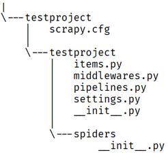
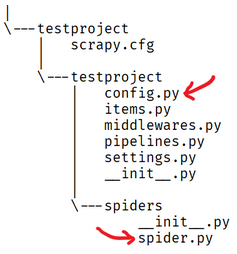
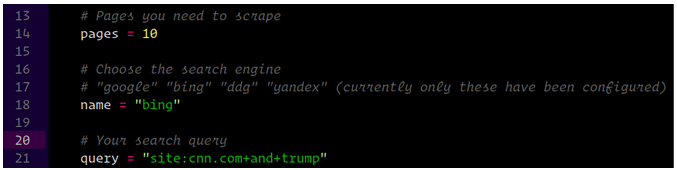
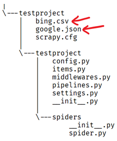
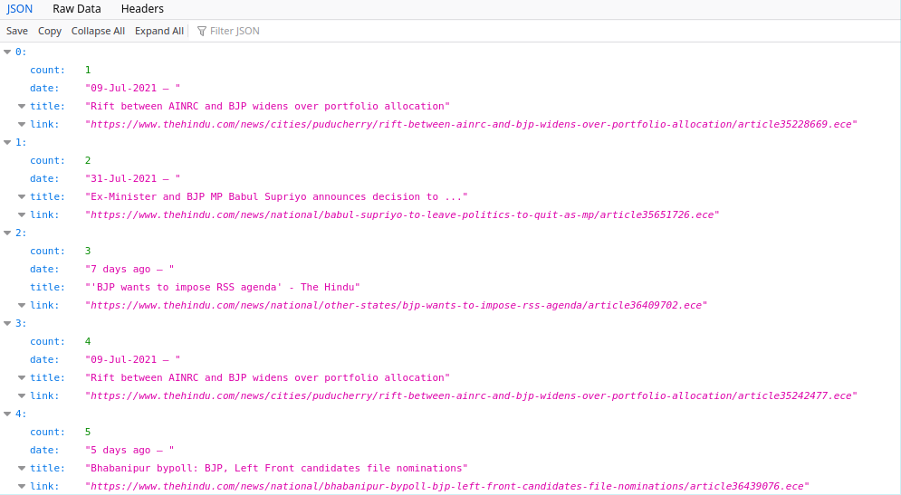

# Extracting search engine results with scrapy
This repo contains python source files for saving search engine results. One use case for it could be to extract links for news articles around a particular event or something similar. 

The results can be optimized by using dorked queries like `site:thehindu.com and bjp`

Pagination support is also added and the number of pages to extract data from can be tweaked in the code. The code is modular because almost all the search engines have a common page structure. 

- Result container
- Result title
- Hyperlink
- Date

So the main task here was to go through the DOM for the engines and construct selectors for each of the above elements and store them in a config file. Python dictionaries have been leveraged for achieving this.

Spider names can be found in `settings.py` which is the config file mentioned above.

Navigate to the [official python docs](https://docs.python.org/3/tutorial/venv.html) to create a virtual environment using `venv` 

Once done, clone this repo to the same folder and run the command `pip install -r requirements.txt`. It will install `scrapy v2.5.0` inside the virtual environment.

## Creating a new scrapy project
Inside the venv run the following command to create a new scrapy project:
`scrapy startproject <PROJECT_NAME>`

For, convenience we’ll name it as `testproject`
After successful execution you should get a directory structure as follows

Open the `settings.py` file inside the subfolder and change the value of `ROBOTSTXT_OBEY` from `True` to `False`
`ROBOTSTXT_OBEY = False`

## Placing files in the correct location
`config.py` contains the configuration parameters for the different search engines. 
And it should be placed inside the subfolder named `testproject` (not the root folder).

`spider.py` contains the main driver code for the scraper and it should be inside the `spiders` subfolder

The final directory structure should look like:

Inside `spider.py`, change the module name to your project name so that contents of `config.py` can be imported. It will be the first line of code.
The syntax will be:
`from <PROJECT_NAME> import config`

## Parameters you can tweak

The `name` variable specifies the name for the spider and the valid ones can be
found in `config.py`

## Running the program

Inside the project, run the command
`scrapy crawl <spider_name> -o <filename>.json` (or `<filename>.csv` for the required format)

A sample command can be 
`scrapy crawl google -o google.json`
or
`scrapy crawl bing -o bing.csv`

The `-o` flag specifies that the program output will be redirected to the next parameter.
The spider can also be run without the `-o` flag, but in that case the output will be limited to the terminal window and not any file.

The output file(s) will be saved in the root of the project directory and it will look like:

## Output

For duckduckgo, the code reusability can't be preserved, because it uses form based pagination, and a separate source file is required to navigate to different pages.

`spider2.py` is the source code for scrapping from ddg. No config file is required for it as the selectors are hardcoded.

## Errors
Exceptions while execution will be logged in the console. If there are any that get triggered because of the selectors, the reason is probably becuase the DOM for the page has change. In that case the selectors in `config.py` have to be updated.